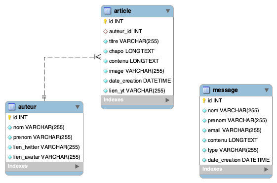

# SAÉ 203 - Site web et Base de données (BDD)
_Les consignes pourront être modifiées._

> **IMPORTANT :** Votre version de PHP doit être supérieure ou égale à la version 7.0.0. **Si ce n'est pas le site ne fonctionnera pas.** Vous aurez une page blanche avec un message d'erreur. 

## Didacticiels
- [Importer une base de données dans phpmyadmin](LISEZ-MOI-IMPORT-SQL.md)
- [Mémo sur les requêtes SQL](LISEZ-MOI-REQUETES-SQL.md)
- [Travailler à plusieurs sur le même serveur php](https://github.com/DanYellow/cours/blob/main/didacticiels-generaux/PARTAGE-SERVEUR.md)
- [Travailler avec l'extension VS Code liveshare](https://github.com/DanYellow/cours/blob/main/didacticiels-generaux/LIVESHARE.md)

## Contexte de la SAÉ
CY Cergy Paris Université nous confie la réalisation d'un site web dédié au BUT Métiers du Multimédia et de l'Internet (MMI). Et pas n'importe lequel puisqu'il s'agit du site sur lequel vous avez travaillé durant la SAÉ 105 dans le but de valider les Apprentissages Critiques (AC) suivants : 

**R212 – Intégration**
- AC4102 : Produire des pages Web statiques et fluides utilisant un balisage sémantique efficace

**R213 – Développement Web**
- AC4103 : Générer des pages Web ou vues à partir de données structurées incluant des interactions simples
- AC4106 : Utiliser et adapter un modèle d’accès aux données

**R213 – Développement Web & R215 – Hébergement**
- AC4104 : Mettre en ligne une application Web en utilisant une solution d’hébergement standard

**R214 – Système d’information**
- AC4105 : Modéliser les données et les traitements d’une application Web 

Comme la SAÉ 105, ceci est un projet de groupe, groupe de 3 à 6 personnes **au sein du même TP/TD.** Un chef devra encore une fois être désigné, car un seul rendu de projet est attendu sur l'ENT. 

Vous partirez du code fourni et contenu dans le dossier `"code/"`. Ce code sert plus ou moins de correction à la SAE 105. Entre-temps des petits changements ont été opérés par rapport à la maquette originale.

- [Télécharger le code de départ la SAE](https://download-directory.github.io/?url=https%3A%2F%2Fgithub.com%2FDanYellow%2Fcours%2Ftree%2Fmain%2Fintegration-web-s2%2Fsae-203)

Il y a des dossiers `"ne-pas-modifier/"`, **merci de ne pas toucher à leur contenu,** toutefois vous pouvez copier un sélecteur CSS présent dans le code de base pour le surcharger dans vos fichiers si besoin est.

Notez également qu'il y a deux dossiers `ressources/`, un à la racine du projet et un autre dans le dossier `administration/`. Ainsi, si vous devez éditer le site principal (celui de la SAE 105), éditez le dossier `ressources/` à la racine du projet, si vous devez éditer l'administration, travaillez dans le dossier `administration/ressources/`.

- [Accéder à la maquette Adobe XD](https://xd.adobe.com/view/9db2b308-f3b3-40d2-9372-2b43c83a277f-c8e1/screen/b2376c6c-7c7d-4071-a7f0-e32f20ac85aa/)


Nous vous remettons le lien vers la maquette Adobe XD, **toutefois vous n'en aurez pas trop besoin,** en effet, votre travail sur cette SAÉ sera de développer de nouvelles pages, dont le contenu textuel et les chemins des images (les cas échéants) seront chargés depuis une base de données.
Les deux pages à réaliser sont : 

- article : lorsqu'on clique sur un article sur la **page d'accueil**, on doit accéder à son contenu. Il y a déjà un fichier `article.php`, **il doit être complété.** Un article doit contenir : 
  - Son titre
  - Son chapô + contenu (dans cet ordre)
  - Son image
  - Sa date de création
  - Son auteur
    - Mettre une valeur par défaut s'il n'y a pas d'auteur
  - Sa vidéo youtube (optionnelle)
    - **Le lecteur Youtube doit s'afficher sur la page de votre site**
    - La balise contenant votre vidéo devra elle-même être contenue dans une balise ayant la classe CSS "youtube-video-conteneur". Exemple :
    ```html
    <!-- Cette classe permet de garder le ratio 16/9 des vidéos -->
    <article class="youtube-video-conteneur">
      <!-- code pour afficher la vidéo de youtube -->
    </article>
    ```
  > Note : Cette page possède un bug concernant le chargement du bon article, à vous de le corriger
- La liste des auteurs du site ("équipe de rédaction")
  - Le lien pour y accéder est déjà dans la navigation mais le fichier php n'existe pas
  - Afficher pour chaque auteur : 
    - Image
    - Prénom
    - Nom
    - Lien vers le compte Twitter
      - Facultatif
      - Mettez le lien vers le compte Twitter de l'université :
        - https://twitter.com/UniversiteCergy

> **Sur ces deux pages, le contenu doit provenir de la base de données.** Vous ne devez pas lister manuellement la liste des auteurs (page équipe de rédaction) ou faire autant de pages qu'il y a d'articles.

Pour ces deux pages, c'est à vous de réaliser le design. Il faudra prendre soin à ce qu'elles contiennent au moins :
- Le haut de page (header) (`<?php require_once('./ressources/includes/header.php'); ?>`)
- Le pied de page (footer) (`<?php require_once('./ressources/includes/footer.php'); ?>`)

La présence des bulles (`<?php require_once('./ressources/includes/bulle.php'); ?>`) est **facultative dans ces deux nouvelles pages.**

Pour vous aider à créer de nouvelles pages pour le front-office, il y a un fichier `squelette.php`. Dupliquez puis renommez-le pour travailler dedans.

Notez qu'il y a été mis une classe "conteneur-1280" pour avoir un conteneur possédant une largeur de 1280px. Ainsi, si vous ajoutez une balise à l'extérieur d'une balise ayant la classe "conteneur-1280", elle occupera toute la largeur de la fenêtre. Idéal pour afficher des images en plein écran.

Nous vous demandons aussi d'apporter des améliorations aux pages existantes. Dans l'accueil, nous souhaitons que vous appliquiez des transitions CSS lors du survol des articles (carré composé : image + texte). Vous avez la liberté de choisir un état de survol (:hover) qui vous semble adapté. Par exemple : transformation de l'échelle de l'image, application du fond au texte, ajout d'un élément graphique...

N'hésitez pas à appliquer ce que nous avons vu, et allons voir durant ce semestre :
- Positionnement CSS
- CSS Transform
- CSS Transition
- Pseudo-éléments ::before / ::after
- ~~Langage de programmation javascript~~
- MySQL
- PHP
- ...

Vous allez devoir également réaliser le back-office du site, vous trouverez plus d'informations concernant cette partie dans la partie dédiée dans ce document.
# Base de données

Comme le nom de la SAE l'indique, elle sera l'occasion de voir les bases de données. Celle du projet ressemble à ceci :


<p style="text-align: center">Schéma de la base de données</p>

Cette base de données est composée de trois tables dont une relation One-to-Many. Ainsi un auteur peut avoir rédigé plusieurs articles, mais un article ne peut avoir qu'un **seul et unique auteur.** De ce fait, on retrouve dans la table "article", la clé étrangère "auteur_id", cette clef peut être nulle, un article peut donc avoir aucun auteur.

Toujours à propos de la table article, la colonne "date_creation" n'est mise à jour **que** lors de la création d'un article (`INSERT INTO`). Pour la gestion de la date, il faudra vous inspirer de ce qui a été fait dans le fichier `contact.php`.

Enfin, la connexion à la base de données est déjà faite, elle se trouve dans le fichier `ressources/includes/connexion-bdd.php`, **il faudra toutefois modifier les paramètres pour que la connexion fonctionne.** Pour ce faire, vous devrez éditer le fichier ".env.dev" à la racine du dossier "code/". Vous devrez remplacer la valeur des variables.

Par ailleurs, il faudra également importer le contenu du fichier `base-de-donnees.sql` dans phpmyadmin pour générer la base de données de travail.

[Script SQL pour créer la base de données MySQL (cliquez sur le bouton "raw" puis faites clic droit > Enregistrer sous)](base-de-donnees.sql).
Le contenu du fichier devra être exécuté dans PhpMyAdmin, onglet "SQL".

> Si l'utilisation du script dans l'onglet ne fonctionne pas sous phpmyadmin. Pensez à décocher "Activer la vérification des clés étrangères".

## Images et base de données
Dans les tables "article" et "auteur" sont gérés des images, ces dernières devront **être gérées par des liens, vous n'avez pas à gérer un système d'upload.** Vous devrez proposer à l'utilisateur de mettre un lien (absolu) vers l'image.

# Fichiers .env
A la racine du projet, vous trouverez deux fichiers commençant par ".env", un de développement (.env.dev) et un autre de production (.env.prod). Ils vous permettront de manipuler sans trop de problèmes certaines configurations concernant la base de données et votre dossier de travail. Les deux fichiers possèdent les mêmes variables, leurs valeurs changera en fonction de l'environnement. Voici une petite description des différentes variables de ces fichiers .env.
```bash
# Contient le dossier qui contient votre projet. Par exemple si votre projet (le contenu du dossier code) est dans un dossier nommé "toto", il faudra mettre comme valeur "toto/".
# Dans le fichier .env.prod, la valeur est inexistante car on part du principe que le contenu du dossier "code/" sera à la racine du serveur. Mais si c'est dans un autre dossier, il faudra mettre une valeur. Pensez bien à mettre la barre oblique à la fin (/) ceci est très important. 
CHEMIN_BASE= 

# Nom de la base de données. Normalement, cette valeur ne change pas
NOM_BDD=sae_203_db
# Nom du serveur de base de données. En local, ça doit être quelque chose comme localhost:NOM-DU-PORT
SERVEUR_BDD=
# A modifier en fonction. Par défaut (en local donc), les valeurs sont "root" et "root" pour le mot de passe et le nom d'utilisateur.
UTILISATEUR_BDD=
MDP_BDD=
```

# Administration (appelé également backoffice)

Grosse partie de cette SAE, elle sera l'occasion de mettre en application les connaissances vues sur tailwindcss et en base de données. Dans le dossier `administration/`, vous trouverez un gabarit de site sous tailwindcss, il faudra compléter le tout de façon à avoir les pages et les fonctionnalités suivantes :
- Articles
  - Création d'article
    - On doit pouvoir associer un auteur à un article
  - Édition d'article
  - Liste d'articles
- Auteur
  - Création d'auteur
  - Édition d'auteur
  - Liste d'auteurs
- Message
  - Liste des messages reçus (depuis le formulaire du site)

Vu que vous débutez en php/mysql, la plupart des requêtes sont déjà présentes, il faudra toutefois les éditer en fonction de vos besoins. **Nous vous invitons à regarder les commentaires ainsi que le fichier REQUETES-SQL.md pour mieux comprendre ces requêtes.**

> N'hésitez pas à tester vos requêtes dans phpmyadmin avant de les insérer dans votre code

La partie "Auteur" est presque complète, et vous servira d'exemple, il faudra remplacer quelques valeurs dans les requêtes pour que les bonnes données soit enregistrées dans la base de données.

> En temps normal, une interface d'administration nécessite un formulaire de connexion pour éviter que n'importe qui intègre des données. Dans le cadre de cette SAÉ, nous allons omettre cette fonctionnalité.
> Toutefois si vous souhaitez le faire, allez-y.

Comme pour le front-office, nous avons mis à disposition un squelette de fichiers pour vous aider. Il vous suffira de dupliquer et le renommer en fonction de vos besoins.

### Redirection après soumission (Administration)

Lors de vos tests, vous remarquerez qu'il ne se passe rien lorsque vous soumettrez vos formulaires du point de vue visuel. C'est normal, il manque le comportement du navigateur après la soumission (car les données ont bien été enregistrées - sauf erreur -). Deux choix s'offrent à vous : 
- Rester sur la page avec les données mises à jour
- Rediriger l'utilisateur vers une autre page

Voici le code pour les deux cas. Ce code est à mettre **après que** les données ont été enregistrées dans la base. Donc après l'appel de la méthode `execute()`.

```php
// L'utilisateur reste sur la même page
$pageRedirection = $_SERVER['HTTP_REFERER'];
header("Location: $pageRedirection"); 
```

```php
// L'utilisateur retourne à la liste des éléments.
// Par exemple : 
// Je crée un article. Je soumets le formulaire. Je suis redirigé vers la liste d'articles grâce au code suivant.
$racineURL = pathinfo($_SERVER['REQUEST_URI']);
$pageRedirection = $racineURL['dirname'];
header("Location: $pageRedirection");
```

# Mise en production
Lorsque vous mettrez votre site en ligne. Assurez-vous bien d'exporter la base de données (avec création de table). De plus pensez à éditer le fichier `.env.prod` avec les valeurs permettant de vous connecter au serveur MySQL de production.
Petit conseil : si vous avez mis localhost pour la valeur de `SERVEUR_BDD`, vous avez fait une erreur à coup sûr.

# Astuces

- **Les fichiers possèdent des commentaires, ne négligez pas leur lecture**, ils sont là pour vous aider
- Vous travaillez en groupe :
  - Ayez la même structure de fichiers, ça sera plus simple après pour tout fusionner
    - **Evitez d'avoir les mêmes noms de fichiers**
  - Rien ne vous empêche de travailler à deux sur les mêmes fonctionnalités et le même ordinateur
  - Il existe l'extension liveshare pour travailler à plusieurs et vous pouvez partager votre serveur WAMP, XAMP... :
    - [Travailler à plusieurs sur le même serveur php](https://github.com/DanYellow/cours/blob/main/didacticiels-generaux/PARTAGE-SERVEUR.md)
    - [Travailler avec l'extension VS Code liveshare](https://github.com/DanYellow/cours/blob/main/didacticiels-generaux/LIVESHARE.md)
- Vous avez appris à utiliser git, n'hésitez pas à l'utiliser pour travailler en équipe et garder un historique de votre travail
- Pour le backoffice (administration), n'allez pas réinventer la roue, tailwindcss propose suffisament de classes pour vous éviter d'en créer de nouvelles.

# Rendus attendus
Etant donné que l'outil git a été abordé durant le semestre, nous vous proposons deux façons de rendre votre projet sur l'ENT : 
  - Une archive avec le nom-prénom du chef de projet
  - Un fichier texte contenant le lien vers le dépôt git **public**

Dans les deux cas, archive ou dépôt git, ceci devra contenir :
  - Le code source du projet
  - La base de données
    - [Voir comment exporter une base de données depuis phpmyadmin](https://kb.planethoster.com/guide/astuces-techniques/exporter-une-base-de-donnees-avec-phpmyadmin/)
  - URL vers le site
    - **Attention :** la mise en ligne du site nécessite également la mise en ligne de la base de données, il faudra penser à l'exporter et la réimporter ensuite
    - Les accès de la base de données sur le serveur sont différents des vôtres en local, faites attention. Il faudra changer les valeurs dans le fichier ".env.prod"
  
> Pensez bien à tester votre site avant de le rendre. Durant la SAE 105, certains ont délivré des bugs facilement repérables avec un simple test.

Votre rendu devra être mis sur Moodle avant la date butoir, **cette date sera donnée ultérieurement.** Un seul rendu est nécessaire par groupe, celui du chef d'équipe. Des points pourront être retirés ou la note nullifée si le devoir est rendu en retard.

# Notation
Les critères suivants seront évalués. Une ou les deux parties peuvent être amenées à être évaluées lors d'un oral dans lequel vous sera demandé de justifier vos choix techniques notamment.

### Intégration Web (HTML/CSS/javascript)
- Qualité du code
  - Pas de classes CSS au nom étrange
  - Réutilisation des classes CSS
    - N'oubliez pas qu'une balise peut avoir plusieurs classes CSS
  - Organisation du code
    - Utiliser la structure déjà présente peut vous aider
  - Sémantique HTML :
    - **Toute utilisation inappropriée de la balise &lt;br> sera sanctionnée**
- Accessibilité
  - &lt;img> avec attribut "alt" même vide
  - Valeur de la balise &lt;title> qui change pour chaque page avec la valeur appropriée
  - Fichier(s) javascript sont chargés avant la fermeture de la balise &lt;body>
  - Unité des police d'écriture en rem
    - **Toute utilisation de l'unité px pour la propriété font-size sera sanctionnée, il faut utiliser l'unité rem**
      - Conversion px -> rem : Diviser la valeur en pixels par 16 pour obtenir la valeur en rem
  - [Voir plus de normes d'accessibilité](https://www.accede-web.com/notices/html-et-css/)
- L'aspect final du site, comment il s'affiche dans un navigateur
  - Le site sera testé sur Firefox et/ou Chrome

### Développement Web (PHP/MySQL)
- Qualité du code
  - Utilisation de la fonction php `require_once()`
    - Une partie du code fourni nécessite d'être optimisée avec la fonction `require_once()`
  - Utilisation de fonctions (quand c'est nécessaire)
  - Lecture et écriture de la base de données
  - Utilisation des paramètres d'url

# Votre liste à faire
- [x] Lire les consignes
- [ ] Importer et connecter la base de données
- [ ] S'approprier le code, bien le regarder (HTML et CSS), faire des tests pour mieux comprendre le code
- [ ] Mettre des CSS transitions
- [ ] Compléter l'administration 
    - [ ] Je peux ajouter / éditer :
      - [ ] Un article / auteur
    - [ ] Je peux lister :
      - [ ] Tous les articles / auteurs
    - [ ] Mettre à jour la liste des entrées du menu dans l'administration avec les membres de mon équipe
    - Edition à réaliser dans le fichier `administration/ressources/includes/menu-lateral-footer.php`
- [ ] Design des pages "article" et "équipe de rédaction"
- [ ] Complétion de la page "équipe de rédaction"
- [ ] Complétion de la page "article"
  - [ ] Chaque article (sur la page d'accueil) doit charger un contenu différent
- [ ] Respecter les normes d'accessibilité web (liste non exhaustive)
  - [ ] Mes images possèdent un attribut "alt"
  - [ ] L'unité de la propriété "font-size" est rem
  - [ ] Je n'utilise pas de balises &lt;br> de façon inappropriée
- [ ] Rajouter un favicon (image au choix)
- [ ] Toutes mes pages sont accessibles, je n'ai pas d'erreur 404 (page non trouvée) quand je clique sur un lien
- [ ] Rendre le projet 
  - Voir section [Rendus Attendus](#rendus-attendus) pour plus d'informations
  


# FAQ - Foire Aux Questions
- **Est-il possible d'utiliser tailwindcss également sur le front-office ?**

  Oui, vous avez tout à fait le droit.
- **Est-il possible d'ajouter de nouvelles tables à la base de données ?**
  
  Si vous estimez que de nouvelles tables sont nécéssaires, n'hésitez pas.

- **Devons-nous changer le contenu des balises &lt;title> ?**
  
  Oui, pour rappel, la balise &lt;title> est très importante pour le référencement et l'accessibilité. Assurez-vous d'avoir des valeurs claires et uniques pour cette balise.


# Pour aller plus loin
[Voir la liste des ajouts possibles au projet pour aller plus loin](POUR-ALLER-PLUS-LOIN.md)
